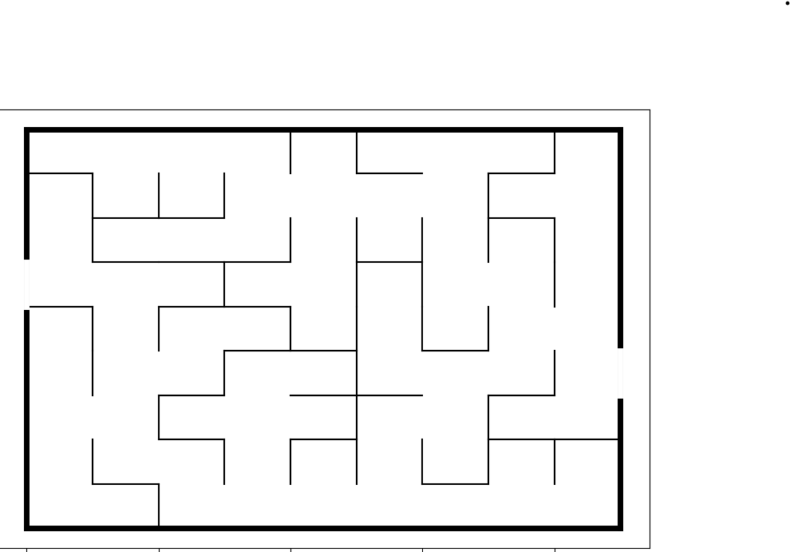
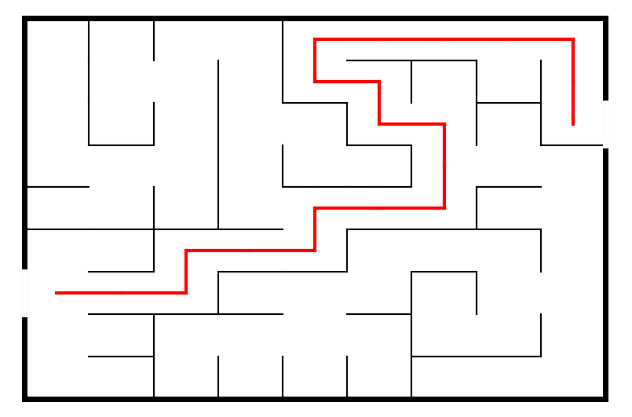

## Labyrinthe

Ce programme permet de générer et de résoudre des labyrinthes.

## Installation
1. Cloner ce repository sur votre ordinateur en utilisant la commande suivante :
    ```sh
    https://github.com/FouSpeed/labyrinthe.git
    ```

## Utilisation

1. Initialisez le labyrinthe en entrant une valeur pour `l'abscisse` et `l'ordonnée`. Les deux valeurs doivent être `égales`.
2. Vous aurez le choix entre 2 possibilitées
- `o` pour afficher le labyrinthe ainsi que la solution
- `n` pour afficher que le labyrinthe sans la solution
3. Si vous avez choisi de trouver la solution, le programme affichera le chemin le plus court pour atteindre la sortie. Sinon, il affichera simplement le labyrinthe.


## Exemple

Voici des exemples d'utilisation du programme :


-Ce code générera un labyrinthe de 10 par 10



-Ce code générera un labyrinthe de 10 par 10 et affichera le chemin le plus court pour atteindre la sortie.


